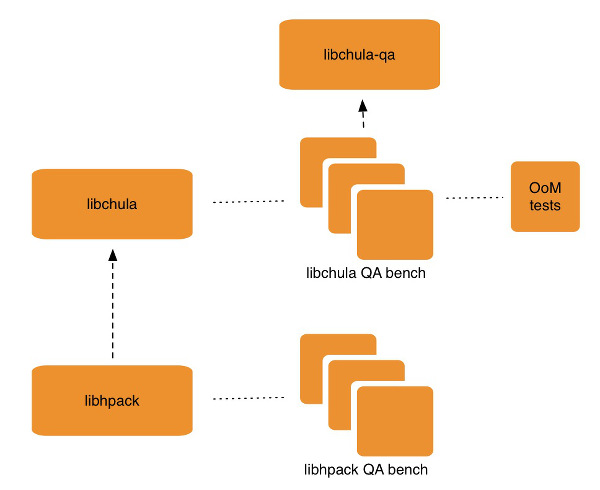

# libhpack
**libhpack** implements HPACK “**Header Compression for HTTP/2.0**”, a format adapted to efficiently represent HTTP header fields in the context of the upcoming HTTP/2.0 protocol.

[](https://travis-ci.org/alobbs/libhpack) [](https://coveralls.io/r/alobbs/libhpack?branch=master) [](https://scan.coverity.com/projects/1496)

***


## Getting Started
Build requirements include Cmake, and Check.

```
git clone --recursive https://github.com/alobbs/libhpack.git
cd libhpack
make
```
To render the documentation you'd have to execute ```make doc``` afterwards. That specific target depends on Sphinx and Doxygen.

## Community
Keep track of community news and rub shoulders with the developers:

* Follow @[http2d](https://twitter.com/http2d) on Twitter
* On `irc.freenode.net` server, in the `#cherokee` channel
* [Bug Tracker](https://github.com/alobbs/libhpack/issues): Issues and RFEs

## License
libhpack is distributed under the [Simplified BSD License](http://opensource.org/licenses/BSD-2-Clause). See the LICENSE file for more info.

## Contribute

You can help this project by reporting problems, suggestions, or contributing to the code.

### Report a problem or suggestion

Go to our [issue tracker](https://github.com/alobbs/libhpack/issues) and check if your problem/suggestion is already reported. If not, create a new issue with a descriptive title and detail your suggestion or steps to reproduce the problem.

### Contribute to the code

If you know how to code, we welcome you to send fixes and new features, but in order to be efficient we ask you to follow the following procedure:

* Fork this repo using the button at the top.
* Clone your forked repo locally.

``$ git clone git@github.com:yourname/libhpack.git``

* Don't modify or work on the master branch, we'll use it to always be in sync with libhpack upstream.

```
$ git remote add upstream git@github.com:alobbs/libhpack.git
$ git fetch upstream
```

* Always create a new issue when you plan to work on a bug or new feature and wait for other devs input before start coding.
* Once the new feature is approved or the problem confirmed, go to your local copy and create a new branch to work on it. Use a descriptive name for it, include the issue number for reference.

``$ git checkout -b bug-33``

* Do your coding and push it to your fork. Include as few commits as possible (one should be enough) and a good description. Always include a reference to the issue with "Fix #number".

```
$ git add .
$ git commit -m "Improved header decoding. Fix #33"
$ git push origin bug-33
```

* Do a new pull request from your "bug-33" branch to libhpack "master".

#### How do changes suggested on a pull request

Some times when you do a PR, you will be asked to correct some code. You can do it on your work branch and commit normally, PR will be automatically updated.

``$ git commit -am "Ops, fixing typo"``

Once everything is okay, you will be asked to merge all commit messages into one to keep history clean.

``$ git rebase -i master``

Edit the file and mark as fixup (f) all commits you want to merge with the first one:

```
pick 1c85e07 Improved header decoding. Fix #33
f c595f79 Ops, fixing typo
```

Once rebased you can force a push to your fork branch and the PR will be automatically updated.

``$ git push origin bug-33 --force``

#### How to keep your local branches updated

To keep your local master branch updated with upstream master, regularly do:

```
$ git fetch upstream
$ git checkout master
$ git pull --rebase upstream master
```

To update the branch you are coding in:

```
$ git checkout bug-33
$ git rebase master
```

## Architecture
The current 10,000 foot view of the project is:


* **libchula**: Utility library that provides a wide variaty of basic classes.
* **libchula-qa**: Bits and pieces necessary to build a QA bench for a libchula based project. Among different things, it includes the "Out of Memory" (OoM) emulator that is used to ensure memory management corner cases as correctly handled.
* **libhpack**: The HTTP2 header parsing library. It's a libchula based library implementing the encoding and decoding of HTTP2 headers.

## References
* HTTPbis Working Group: HPACK:  
http://tools.ietf.org/html/draft-ietf-httpbis-header-compression-06

--
Alvaro Lopez Ortega  
[alvaro@gnu.org](mail:alvaro@gnu.org)
